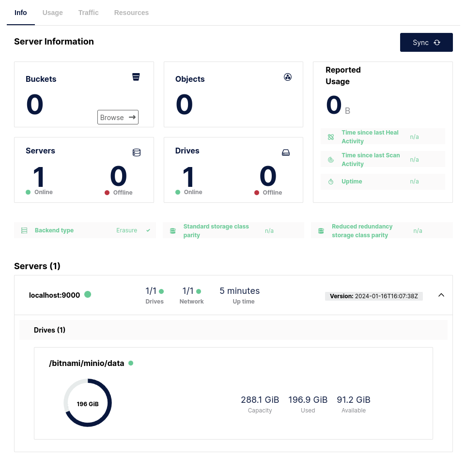

# homelabk8s

## Essentials

For the sake of this home-lab you should have installed (preferably on Debian or Ubuntu derived distro):

- Docker
- Kubectl
- Helm
- Visual Studio Code

## K3D

First install K3D with:

```shell
curl -s https://raw.githubusercontent.com/k3d-io/k3d/main/install.sh | bash
```

Then:

```shell
k3d cluster create $NAME
```

After about 15 seconds type:

```shell
alias kctl=kubectl
source ~/.zshrc

$ kctl get pods -A
NAMESPACE     NAME                                     READY   STATUS      RESTARTS   AGE
kube-system   local-path-provisioner-957fdf8bc-9g4j2   1/1     Running     0          26s
kube-system   metrics-server-648b5df564-rdd8c          0/1     Running     0          26s
kube-system   coredns-77ccd57875-vv7cr                 1/1     Running     0          26s
kube-system   helm-install-traefik-crd-tngks           0/1     Completed   0          26s
kube-system   svclb-traefik-706b367d-m4l9g             2/2     Running     0          14s
kube-system   helm-install-traefik-q4vpc               0/1     Completed   1          26s
kube-system   traefik-64f55bb67d-65c7b                 1/1     Running     0          14s
```

Voula!

In order to stop it if not needed, type:

```shell
k3d cluster stop $NAME
```

## Bitnami Helm Repo

Add **Bitnami** repo:

```shell
helm repo add bitnami https://charts.bitnami.com/bitnami && helm repo update
```

## Minio (AWS S3 storage type)

For **Minio** type:

```shell
cd ~/repos/homelabk8s/ && mkdir charts/minio && cd charts/minio
helm show values bitnami/minio > values.yaml
code values.yaml
```

Edit storage class as as: `storageClass: "local-path"` and save the file.

Since it is going to fake the real S3 object storage, I tend to use S3 name for a namespace.

To do so, type:

```shell
$ kctl create namespace s3
namespace/s3 created
$ helm install minio bitnami/minio --namespace s3 --values values.yaml
NAME: minio
LAST DEPLOYED: Wed Jan 17 00:48:04 2024
NAMESPACE: s3
STATUS: deployed
REVISION: 1
TEST SUITE: None
NOTES:
CHART NAME: minio
CHART VERSION: 13.0.3
APP VERSION: 2024.1.16
(...)

$ kctl get pods -n s3
NAME                     READY   STATUS    RESTARTS   AGE
minio-59d88489f5-j465v   1/1     Running   0          2m38s
```

Since it's home-lab, we should not care too much about security.

Passwords are stored in secrets:

```shell
kubectl get secret --namespace s3 minio -o jsonpath="{.data.root-user}" | base64 -d
kubectl get secret --namespace s3 minio -o jsonpath="{.data.root-password}" | base64 -d
```

To access UI type:

```shell
kctl -n s3 port-forward svc/minio 9001:9001
```

Voula!


